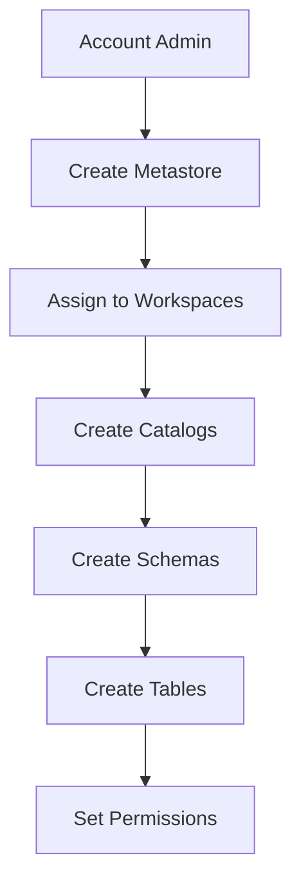
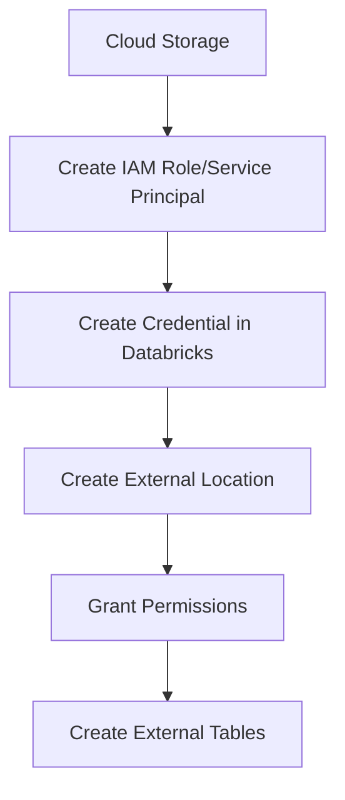

# Databricks Storage System - Complete Study Guide

## Table of Contents
1. [Overview](#overview)
2. [Managed Storage](#managed-storage)
3. [External Storage](#external-storage)
4. [Best Practices](#best-practices)
5. [Troubleshooting](#troubleshooting)

## Overview

Databricks provides two main types of storage systems:

- **Managed Storage**: Databricks handles the storage location and lifecycle
- **External Storage**: You control the storage location and permissions

```
Databricks Storage
├── Managed Storage
│   ├── Default Metastore
│   ├── Custom Metastore
│   └── Unity Catalog
└── External Storage
    ├── External Locations
    └── Mount Points
```

---

## Managed Storage

### 1. Default Metastore

The default metastore is automatically created when you set up a Databricks workspace.

#### Characteristics:
- Stores metadata in Databricks-managed database
- Data stored in workspace's root DBFS location
- Limited to single workspace
- Basic security model

#### Example Usage:
```sql
-- Create database in default metastore
CREATE DATABASE sales_db;

-- Create table (data stored in DBFS)
CREATE TABLE sales_db.customers (
    customer_id INT,
    name STRING,
    email STRING
) USING DELTA;

-- Insert data
INSERT INTO sales_db.customers VALUES 
(1, 'John Doe', 'john@example.com'),
(2, 'Jane Smith', 'jane@example.com');
```

#### Data Flow:
```
User Query → Default Metastore → DBFS Storage
                    ↓
              Metadata stored in
              Databricks-managed DB
```

### 2. Creating Custom Metastore

Custom metastore allows you to specify your own storage location for metadata.

#### Implementation Steps:

**Step 1: Create Storage Location**
```sql
-- Create external location for metastore
CREATE EXTERNAL LOCATION metastore_location
URL 's3://my-bucket/metastore/'
WITH (CREDENTIAL `my-aws-credential`);
```

**Step 2: Create Custom Metastore**
```sql
-- Create metastore with custom location
CREATE METASTORE my_custom_metastore
LOCATION 's3://my-bucket/metastore/'
WITH CREDENTIAL `my-aws-credential`;
```

**Step 3: Assign to Workspace**
```python
# Using Databricks CLI or REST API
databricks metastores assign my_custom_metastore --workspace-id 12345
```

#### Data Flow:
```
User Query → Custom Metastore → Your S3/ADLS/GCS
                    ↓
              Metadata stored in
              your specified location
```

### 3. Unity Catalog

Unity catalog provides centralized governance across multiple workspaces.

#### Architecture:
```
Unity Catalog
├── Metastore (Region-level)
│   ├── Catalog 1
│   │   ├── Schema A
│   │   │   ├── Table 1
│   │   │   └── Table 2
│   │   └── Schema B
│   └── Catalog 2
└── External Locations
```

#### Implementation Flow:

**Step 1: Enable Unity Catalog**
```python
# Enable in workspace settings
# Account Admin → Workspaces → Settings → Unity Catalog
```

**Step 2: Create Metastore**
```sql
-- Create Unity Catalog metastore
CREATE METASTORE unity_metastore
LOCATION 's3://my-unity-bucket/metastore/'
WITH CREDENTIAL `unity-credential`;
```

**Step 3: Create Catalog**
```sql
-- Create catalog in Unity Catalog
CREATE CATALOG sales_catalog
COMMENT 'Sales data catalog';
```

**Step 4: Create Schema**
```sql
-- Create schema within catalog
CREATE SCHEMA sales_catalog.customer_data
COMMENT 'Customer information schema';
```

**Step 5: Create Table**
```sql
-- Create table in Unity Catalog
CREATE TABLE sales_catalog.customer_data.customers (
    customer_id BIGINT,
    name STRING,
    email STRING,
    created_date DATE
) USING DELTA
LOCATION 's3://my-data-bucket/customers/';
```

### 4. Creating Catalog with Custom Location

#### Method 1: Catalog with Default Managed Location
```sql
-- Catalog uses Unity Catalog metastore location
CREATE CATALOG marketing_catalog;
```

#### Method 2: Catalog with Custom Location
```sql
-- First create external location
CREATE EXTERNAL LOCATION marketing_storage
URL 's3://marketing-bucket/data/'
WITH (CREDENTIAL `marketing-credential`);

-- Create catalog with custom location
CREATE CATALOG marketing_catalog
MANAGED LOCATION 's3://marketing-bucket/data/';
```

### 5. Assigning Custom Locations

#### Schema Level:
```sql
-- Schema with custom location
CREATE SCHEMA sales_catalog.regional_data
MANAGED LOCATION 's3://regional-bucket/data/';
```

#### Table Level:
```sql
-- Table with specific location
CREATE TABLE sales_catalog.customer_data.vip_customers (
    customer_id BIGINT,
    tier STRING,
    lifetime_value DECIMAL(10,2)
) USING DELTA
LOCATION 's3://vip-bucket/customers/';
```

### 6. Data Storage Flow Scenarios

#### Scenario A: Fully Managed
```
CREATE CATALOG → CREATE SCHEMA → CREATE TABLE
        ↓              ↓              ↓
   Unity Catalog  Unity Catalog  Unity Catalog
   Location       Location       Location
```

#### Scenario B: Custom Catalog Location
```
CREATE CATALOG with LOCATION → CREATE SCHEMA → CREATE TABLE
              ↓                     ↓              ↓
        Custom S3 Bucket      Custom Bucket  Custom Bucket
```

#### Scenario C: Mixed Locations
```
CREATE CATALOG → CREATE SCHEMA with LOCATION → CREATE TABLE with LOCATION
        ↓                    ↓                        ↓
   Unity Catalog        Custom Schema Bucket    Custom Table Bucket
   Location
```

### 7. Drop and Undrop Tables in Unity Catalog

#### Drop Table:
```sql
-- Soft delete (can be recovered)
DROP TABLE sales_catalog.customer_data.customers;

-- Check dropped tables
SHOW TABLES IN sales_catalog.customer_data DROPPED;
```

#### Undrop Table:
```sql
-- Restore dropped table
UNDROP TABLE sales_catalog.customer_data.customers;

-- Verify restoration
DESCRIBE TABLE sales_catalog.customer_data.customers;
```

#### Permanent Delete:
```sql
-- Permanent deletion (cannot be recovered)
DROP TABLE sales_catalog.customer_data.customers PURGE;
```

#### Drop/Undrop Flow:
```
Active Table → DROP → Soft Deleted State → UNDROP → Active Table
     ↓                        ↓
  (accessible)         (not accessible)
                           ↓
                    DROP with PURGE
                           ↓
                   Permanently Deleted
                    (cannot recover)
```

---

## External Storage

### 1. Ways to Store External Data

#### Option 1: External Locations (Recommended)
#### Option 2: Mount Points (Legacy)

### 2. External Locations

External locations provide secure access to cloud storage with proper governance.

#### Implementation Steps:

**Step 1: Create Credential**
```sql
-- For AWS S3
CREATE CREDENTIAL aws_s3_credential
WITH IDENTITY 'arn:aws:iam::123456789:role/databricks-role';

-- For Azure ADLS
CREATE CREDENTIAL azure_credential
WITH IDENTITY 'abfss://container@storage.dfs.core.windows.net/'
AZURE_SERVICE_PRINCIPAL_CLIENT_ID 'client-id'
AZURE_SERVICE_PRINCIPAL_CLIENT_SECRET 'client-secret'
AZURE_TENANT_ID 'tenant-id';
```

**Step 2: Create External Location**
```sql
-- Create external location
CREATE EXTERNAL LOCATION external_data_lake
URL 's3://external-data-bucket/raw-data/'
WITH (CREDENTIAL `aws_s3_credential`)
COMMENT 'External data lake for raw data';
```

**Step 3: Grant Permissions**
```sql
-- Grant access to external location
GRANT READ FILES ON EXTERNAL LOCATION external_data_lake TO `data-engineers`;
GRANT WRITE FILES ON EXTERNAL LOCATION external_data_lake TO `data-engineers`;
```

**Step 4: Use External Location**
```sql
-- Create table using external location
CREATE TABLE sales_catalog.raw_data.customer_uploads (
    customer_id BIGINT,
    upload_date DATE,
    file_path STRING
) USING DELTA
LOCATION 's3://external-data-bucket/raw-data/customers/';

-- Read files from external location
SELECT * FROM read_files(
    's3://external-data-bucket/raw-data/*.parquet',
    format => 'parquet'
);
```

#### External Location Flow:
```
External Storage → Credential → External Location → Table/Query
       ↓               ↓              ↓              ↓
   S3/ADLS/GCS    IAM Role/SPN   Unity Catalog   Databricks
```

### 3. Mount Points (Legacy)

Mount points create a virtual filesystem that maps cloud storage to DBFS paths.

#### Implementation Steps:

**Step 1: Create Mount Point**
```python
# Mount S3 bucket
dbutils.fs.mount(
    source="s3a://my-external-bucket",
    mount_point="/mnt/external-data",
    extra_configs={
        "fs.s3a.access.key": "your-access-key",
        "fs.s3a.secret.key": "your-secret-key"
    }
)
```

**Step 2: Verify Mount**
```python
# List mounted filesystems
dbutils.fs.mounts()

# List files in mounted location
dbutils.fs.ls("/mnt/external-data")
```

**Step 3: Use Mounted Data**
```python
# Read data from mounted location
df = spark.read.parquet("/mnt/external-data/customer-data/")
df.show()

# Create table using mounted path
spark.sql("""
    CREATE TABLE customer_external
    USING PARQUET
    LOCATION '/mnt/external-data/customer-data/'
""")
```

#### Mount Point Flow:
```
Cloud Storage → Mount Point → DBFS Path → Databricks Tables
      ↓             ↓           ↓              ↓
  S3/ADLS/GCS  /mnt/data   Virtual Path   Delta Tables
```

### 4. External vs Mount Comparison

| Feature | External Locations | Mount Points |
|---------|-------------------|--------------|
| **Governance** | Unity Catalog integrated | Limited |
| **Security** | Fine-grained permissions | Basic |
| **Multi-workspace** | Yes | No |
| **Recommended** | ✅ Yes | ❌ Legacy |

---

## Complete Implementation Examples

### Example 1: End-to-End Managed Storage with Unity Catalog

```sql
-- 1. Create catalog
CREATE CATALOG ecommerce_catalog;

-- 2. Create schema
CREATE SCHEMA ecommerce_catalog.sales_data;

-- 3. Create managed table
CREATE TABLE ecommerce_catalog.sales_data.orders (
    order_id BIGINT,
    customer_id BIGINT,
    order_date DATE,
    total_amount DECIMAL(10,2)
) USING DELTA;

-- 4. Insert sample data
INSERT INTO ecommerce_catalog.sales_data.orders VALUES
(1001, 501, '2024-01-15', 299.99),
(1002, 502, '2024-01-16', 149.50),
(1003, 501, '2024-01-17', 75.25);

-- 5. Query data
SELECT customer_id, COUNT(*) as order_count, SUM(total_amount) as total_spent
FROM ecommerce_catalog.sales_data.orders
GROUP BY customer_id;
```

### Example 2: External Storage with External Locations

```sql
-- 1. Create credential
CREATE CREDENTIAL data_lake_credential
WITH IDENTITY 'arn:aws:iam::123456789:role/databricks-external-role';

-- 2. Create external location
CREATE EXTERNAL LOCATION external_raw_data
URL 's3://company-data-lake/raw/'
WITH (CREDENTIAL `data_lake_credential`);

-- 3. Create external table
CREATE TABLE ecommerce_catalog.external_data.raw_events (
    event_id STRING,
    user_id STRING,
    event_type STRING,
    timestamp TIMESTAMP,
    properties MAP<STRING, STRING>
) USING DELTA
LOCATION 's3://company-data-lake/raw/events/';

-- 4. Load data from external files
COPY INTO ecommerce_catalog.external_data.raw_events
FROM 's3://company-data-lake/incoming/*.json'
FILEFORMAT = JSON;
```

### Example 3: Mixed Storage Strategy

```sql
-- Managed catalog for processed data
CREATE CATALOG analytics_catalog;
CREATE SCHEMA analytics_catalog.curated_data;

-- External location for raw data
CREATE EXTERNAL LOCATION raw_data_location
URL 's3://raw-data-bucket/'
WITH (CREDENTIAL `raw_data_credential`);

-- External table for raw data
CREATE TABLE analytics_catalog.curated_data.raw_customer_events
USING DELTA
LOCATION 's3://raw-data-bucket/events/';

-- Managed table for processed data
CREATE TABLE analytics_catalog.curated_data.customer_metrics (
    customer_id BIGINT,
    total_orders INT,
    total_spent DECIMAL(10,2),
    last_order_date DATE
) USING DELTA;

-- ETL process: External → Managed
INSERT INTO analytics_catalog.curated_data.customer_metrics
SELECT 
    customer_id,
    COUNT(*) as total_orders,
    SUM(order_amount) as total_spent,
    MAX(order_date) as last_order_date
FROM analytics_catalog.curated_data.raw_customer_events
GROUP BY customer_id;
```

---

## Implementation Flows

### Flow 1: Setting Up Unity Catalog (Complete Process)



**Step-by-step Implementation:**

```sql
-- 1. Create Unity Catalog metastore (Account Admin)
CREATE METASTORE production_metastore
LOCATION 's3://unity-metastore-bucket/'
WITH CREDENTIAL `metastore-credential`;

-- 2. Create catalog
CREATE CATALOG production_catalog;

-- 3. Create schema
CREATE SCHEMA production_catalog.customer_analytics;

-- 4. Create table with custom location
CREATE TABLE production_catalog.customer_analytics.customer_segments (
    segment_id INT,
    segment_name STRING,
    customer_count BIGINT
) USING DELTA
LOCATION 's3://analytics-bucket/customer-segments/';

-- 5. Set permissions
GRANT USE CATALOG ON CATALOG production_catalog TO `analysts`;
GRANT USE SCHEMA ON SCHEMA production_catalog.customer_analytics TO `analysts`;
GRANT SELECT ON TABLE production_catalog.customer_analytics.customer_segments TO `analysts`;
```

### Flow 2: External Location Setup



**Implementation:**

```sql
-- 1. Create credential (maps to cloud IAM)
CREATE CREDENTIAL external_s3_credential
WITH IDENTITY 'arn:aws:iam::123456789:role/external-data-role';

-- 2. Create external location
CREATE EXTERNAL LOCATION customer_data_lake
URL 's3://customer-data-lake/processed/'
WITH (CREDENTIAL `external_s3_credential`);

-- 3. Grant permissions
GRANT READ FILES ON EXTERNAL LOCATION customer_data_lake TO `data-team`;

-- 4. Create external table
CREATE TABLE production_catalog.external_data.customer_profiles
USING DELTA
LOCATION 's3://customer-data-lake/processed/profiles/';
```

---

## Drop and Undrop Operations

### Understanding Table States

```
Active Table → Dropped (Soft Delete) → Purged (Hard Delete)
     ↑              ↓                        ↓
  Accessible    Not Accessible         Permanently Gone
     ↑              ↓                        
  UNDROP      Cannot Undrop
```

### Drop Operations

#### Soft Drop (Recoverable):
```sql
-- Drop table (soft delete)
DROP TABLE production_catalog.customer_analytics.customer_segments;

-- Table is hidden but data remains
-- Can be viewed in dropped tables
SHOW TABLES IN production_catalog.customer_analytics DROPPED;
```

#### Hard Drop (Permanent):
```sql
-- Permanent deletion
DROP TABLE production_catalog.customer_analytics.customer_segments PURGE;

-- Cannot be recovered
```

### Undrop Operations

```sql
-- List dropped tables
SHOW TABLES IN production_catalog.customer_analytics DROPPED;

-- Restore specific table
UNDROP TABLE production_catalog.customer_analytics.customer_segments;

-- Verify restoration
DESCRIBE TABLE production_catalog.customer_analytics.customer_segments;
```

### Practical Example:

```sql
-- 1. Create test table
CREATE TABLE test_catalog.test_schema.temp_table (
    id INT,
    name STRING
) USING DELTA;

-- 2. Insert data
INSERT INTO test_catalog.test_schema.temp_table VALUES (1, 'Test');

-- 3. Drop table
DROP TABLE test_catalog.test_schema.temp_table;

-- 4. Verify it's dropped
SHOW TABLES IN test_catalog.test_schema; -- Won't show temp_table

-- 5. Check dropped tables
SHOW TABLES IN test_catalog.test_schema DROPPED; -- Shows temp_table

-- 6. Restore table
UNDROP TABLE test_catalog.test_schema.temp_table;

-- 7. Verify restoration
SELECT * FROM test_catalog.test_schema.temp_table; -- Data is back!
```

---

## Mount Points (Legacy Method)

### When to Use Mount Points:
- Legacy workspaces without Unity Catalog
- Simple file access scenarios
- Temporary data access

### Implementation:

#### Mount S3 Bucket:
```python
# Mount S3 bucket
dbutils.fs.mount(
    source="s3a://external-bucket/data/",
    mount_point="/mnt/external-data",
    extra_configs={
        "fs.s3a.aws.credentials.provider": "org.apache.hadoop.fs.s3a.InstanceProfileCredentialsProvider"
    }
)
```

#### Mount Azure ADLS:
```python
# Mount Azure Data Lake
dbutils.fs.mount(
    source="abfss://container@storage.dfs.core.windows.net/",
    mount_point="/mnt/azure-data",
    extra_configs={
        "fs.azure.account.auth.type.storage.oauth2": "org.apache.hadoop.fs.azurebfs.oauth2.ClientCredsTokenProvider",
        "fs.azure.account.oauth2.client.id.storage": "client-id",
        "fs.azure.account.oauth2.client.secret.storage": "client-secret",
        "fs.azure.account.oauth2.client.endpoint.storage": "https://login.microsoftonline.com/tenant-id/oauth2/token"
    }
)
```

#### Using Mounted Data:
```python
# List files in mounted location
dbutils.fs.ls("/mnt/external-data")

# Read data
df = spark.read.parquet("/mnt/external-data/customer-data/")

# Create table pointing to mounted location
spark.sql("""
    CREATE TABLE mounted_customers
    USING PARQUET
    LOCATION '/mnt/external-data/customer-data/'
""")
```

#### Unmount:
```python
# Unmount when no longer needed
dbutils.fs.unmount("/mnt/external-data")
```

---

## Decision Matrix: Which Storage Type to Choose?

### Use Managed Storage When:
- ✅ Starting new projects
- ✅ Need simple setup
- ✅ Want Databricks to handle storage lifecycle
- ✅ Using Unity Catalog governance

### Use External Storage When:
- ✅ Data exists in external systems
- ✅ Need to share data with non-Databricks systems
- ✅ Compliance requires specific storage locations
- ✅ Cost optimization for large datasets

### Migration Path:
```
Legacy Workspace → Unity Catalog Enabled → External Locations → Governance
       ↓                    ↓                     ↓               ↓
  Mount Points      Create Metastore      Replace Mounts    Set Permissions
```

---

## Best Practices

### 1. Storage Organization
```
metastore/
├── bronze/          # Raw data
│   ├── events/
│   └── uploads/
├── silver/          # Cleaned data
│   ├── customers/
│   └── orders/
└── gold/           # Business metrics
    ├── dashboards/
    └── reports/
```

### 2. Naming Conventions
```sql
-- Consistent naming
catalog_name: business_unit_env (e.g., sales_prod, marketing_dev)
schema_name: data_layer_domain (e.g., bronze_events, silver_customers)
table_name: descriptive_name (e.g., customer_profiles, daily_sales)
```

### 3. Security Model
```sql
-- Hierarchical permissions
GRANT USE CATALOG ON CATALOG sales_prod TO `sales-team`;
GRANT USE SCHEMA ON SCHEMA sales_prod.silver TO `analysts`;
GRANT SELECT ON TABLE sales_prod.silver.customers TO `reporting-service`;
```

---

## Troubleshooting

### Common Issues and Solutions

#### Issue 1: Permission Denied
```sql
-- Check permissions
SHOW GRANT ON TABLE catalog.schema.table;

-- Grant necessary permissions
GRANT SELECT ON TABLE catalog.schema.table TO `user@company.com`;
```

#### Issue 2: External Location Not Working
```sql
-- Test external location access
LIST 's3://bucket-name/path/';

-- Check credential
DESCRIBE CREDENTIAL credential_name;
```

#### Issue 3: Mount Point Failures
```python
# Check existing mounts
dbutils.fs.mounts()

# Unmount and remount
dbutils.fs.unmount("/mnt/path")
# Then remount with correct configuration
```

#### Issue 4: Table Not Found After Undrop
```sql
-- Check if table exists in dropped state
SHOW TABLES IN schema_name DROPPED;

-- Use full three-part name for undrop
UNDROP TABLE catalog.schema.table_name;
```

---

## Quick Reference Commands

### Catalog Management:
```sql
SHOW CATALOGS;
CREATE CATALOG catalog_name;
DROP CATALOG catalog_name CASCADE;
DESCRIBE CATALOG catalog_name;
```

### Schema Management:
```sql
SHOW SCHEMAS IN catalog_name;
CREATE SCHEMA catalog.schema_name;
DROP SCHEMA catalog.schema_name CASCADE;
```

### Table Management:
```sql
SHOW TABLES IN catalog.schema;
CREATE TABLE catalog.schema.table_name (...);
DROP TABLE catalog.schema.table_name;
UNDROP TABLE catalog.schema.table_name;
SHOW TABLES IN catalog.schema DROPPED;
```

### External Locations:
```sql
SHOW EXTERNAL LOCATIONS;
CREATE EXTERNAL LOCATION name URL 'path' WITH (CREDENTIAL `cred`);
DESCRIBE EXTERNAL LOCATION name;
```

---

## Summary

This guide covers the complete Databricks storage ecosystem. Start with Unity Catalog for new implementations, use external locations for external data access, and gradually migrate from legacy mount points. Always follow the principle of least privilege for security and organize your data in a clear hierarchy for better governance.
